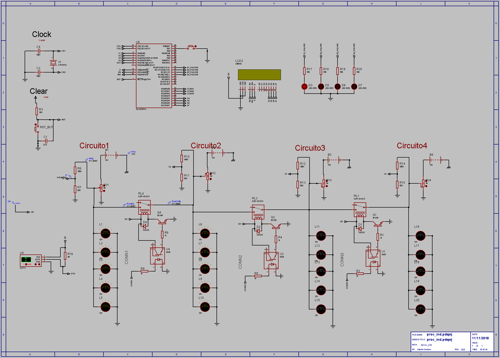

# Controlador-Banco-Baterias

### Trabalho final Microcontroladores e Microprocessadores
#### Sistema inteligente de backup para otimização de uso para bancos de bateria implementado com o controlador PIC 16f877A.

#### Hardware:

#### O software foi desenvolvido com o PIC CCS Compiler
